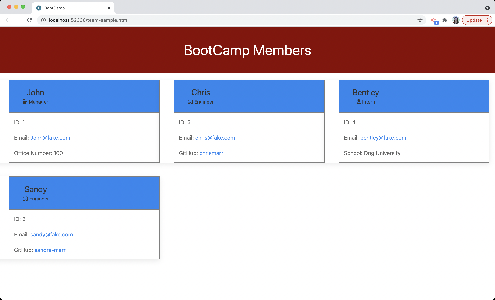

# Team Profile Generator

## Table of Contents
* [Description](#description)
* [Lessons Learned](#lessons-learned)
* [Installation](#installation)
* [Usage](#usage)
* [Tools](#tools)
* [Features](#features)
* [How to Contribute](#how-to-contribute)
* [Tests](#tests)
* [License](#license)
* [Questions](#questions)

## Description 
This application provides a means for developing a team organization chart/profile. This provides an easy way to organize contact information for any team and will allow a simple and quick way to contact members. This is also mobile responsive, so it can be used on the go.  
This solves the problem of having to search for team members contact information. With work being so diverse and dynamic, this application will help keep teams in contact by providing an easy way to enter information, and then a quick and simple view for looking up members and contacting them.

## Lessons Learned
This application involved the use of node.js and related packages (jest and inquirer), and well as some html, css and UIKit for the framework. I found that this project provided a great learning opportunity for working with inquirer, writing tests, developing classes and sub classes in javascript, and scope on both variables and objects returned from prompts. Another topic that I came across when building this application was asynchronous versus synchronous javascript. When generating the HTML page, I ran into some issues with the final piece of the html getting appended to the file before the member cards were completed. While there is still a lot to learn about asynchronous javascript, this was definitely a great way to begin learning.

## Installation
To run this application, you will need to clone the repository to your local machine. Once that is complete, you will need to run "npm i" in the terminal to install jest and inquirer. 

## Usage
After the relevant node modules have been installed, the application can be run and testing in the terminal. To run tests, enter "npm run test" in the terminal. To run the application, enter "node index.js" in the terminal and walk through the questions. 
 
  ### Demo
  
  

## Features
This application features some data entery validation.

## How to Contribute
If you would like to contribute, please follow the relevant steps outlined here: https://www.dataschool.io/how-to-contribute-on-github/ or send feedback to Sandy Marr.

## Tests
There are tests setup for the classes (Employee, Manager, Engineer, Intern). To run the tests, navigate the application directory in the terminal and enter "npm run test".

## Tools
              

## License

Copyright 2021 Sandra Marr

  Permission is hereby granted, free of charge, to any person obtaining a copy of this software and associated documentation files (the "Software"), to deal in the Software without restriction, including without limitation the rights to use, copy, modify, merge, publish, distribute, sublicense, and/or sell copies of the Software, and to permit persons to whom the Software is furnished to do so, subject to the following conditions:
  
  The above copyright notice and this permission notice shall be included in all copies or substantial portions of the Software.
  
  THE SOFTWARE IS PROVIDED "AS IS", WITHOUT WARRANTY OF ANY KIND, EXPRESS OR IMPLIED, INCLUDING BUT NOT LIMITED TO THE WARRANTIES OF MERCHANTABILITY, FITNESS FOR A PARTICULAR PURPOSE AND NONINFRINGEMENT. IN NO EVENT SHALL THE AUTHORS OR COPYRIGHT HOLDERS BE LIABLE FOR ANY CLAIM, DAMAGES OR OTHER LIABILITY, WHETHER IN AN ACTION OF CONTRACT, TORT OR OTHERWISE, ARISING FROM, OUT OF OR IN CONNECTION WITH THE SOFTWARE OR THE USE OR OTHER DEALINGS IN THE SOFTWARE.

## Questions

For any questions, please contact Sandra Marr: [GitHub](https://github.com/sandra-marr) or [Email](srpeters44@gmail.com)